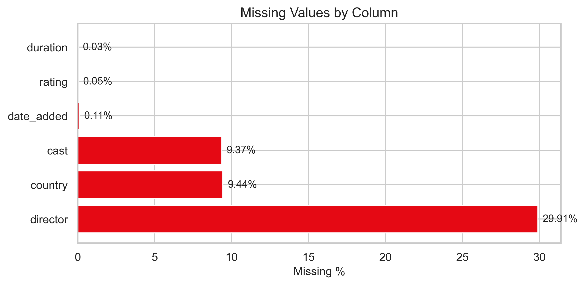
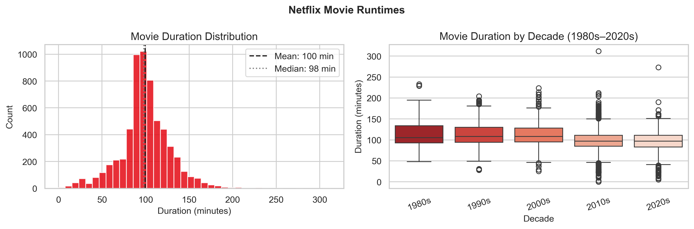
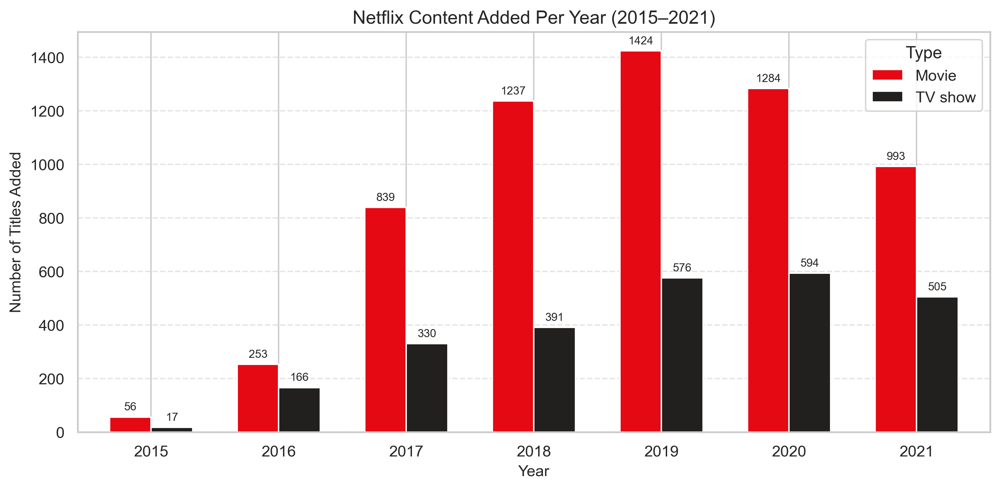

# 🎬 Netflix Content Analysis — Exploratory Data Analysis


---

## 📌 Project Overview

An end-to-end Exploratory Data Analysis (EDA) on Netflix's global content library of **8,800+ titles**.  
This project answers key business questions about content strategy, geographic distribution, genre trends, and audience targeting.

---

## ❓ Key Questions Answered

1. How is Netflix content split between **Movies and TV Shows**?
2. Which **countries** produce the most Netflix content?
3. How has Netflix's **content library grown** year over year?
4. What **genres** dominate the platform?
5. What **ratings** (audience types) does Netflix target most?
6. What is the typical **movie runtime** on Netflix?

---

## 📊 Key Findings

| # | Finding |
|---|---------|
| 🎬 | Movies make up **~69%** of Netflix content, but TV Show additions are growing faster |
| 🌍 | **USA dominates** with 2,818 titles; **India is #2** with 972 — a key growth market |
| 📈 | Content grew **exponentially from 2015–2019**, peaking at ~2,000 titles added in 2019 |
| 🎭 | **International Movies, Dramas & Comedies** are the top 3 genres |
| 🔞 | **TV-MA is the #1 rating** — Netflix primarily targets adult audiences |
| ⏱️ | Average Netflix movie runtime is **~99 minutes**, consistent across decades |

---

## 🗂️ Dataset

- **Source:** [Netflix Movies and TV Shows — Kaggle](https://www.kaggle.com/datasets/shivamb/netflix-shows)
- **Size:** 8,807 rows × 12 columns
- **Columns:** show_id, type, title, director, cast, country, date_added, release_year, rating, duration, listed_in, description

---

## 🛠️ Tools & Libraries

| Tool | Purpose |
|------|---------|
| Python 3.10 | Core language |
| Pandas | Data loading, cleaning, analysis |
| Matplotlib | Charts and visualizations |
| Seaborn | Statistical plots |
| Jupyter Notebook | Interactive analysis environment |

---

## 📁 Project Structure

```
netflix-eda/
│
├── images/
│   ├── movies_vs_tvshows.png
│   ├── Netflix_movie_runtimes.png
│   └── Content_Added_Per_Year.png
│
├── README.md
├── Netflix_Content_Analysis.ipynb
└── netflix_titles.csv
```

---
## 📷 Sample Visualizations

### Movies vs TV Shows



### Top_Conttent_Production_Countries



### Content_Added_Per_Year


---

## 🚀 How to Run

```bash
# 1. Clone the repository
git clone https://github.com/AshutoshNagaich/netflix-data-analysis.git

# 2. Go into project folder
cd netflix-eda

# 2. Install dependencies
pip install pandas matplotlib seaborn jupyter

# 3. Launch Jupyter 
jupyter notebook NetflixEDA_Content_Analysis.ipynb
```

---

## 💡 Skills Demonstrated

- ✅ Data loading and initial exploration
- ✅ Missing value detection and handling
- ✅ Data type conversion (dates, numerics)
- ✅ Groupby aggregations and multi-column analysis
- ✅ String splitting / exploding multi-value columns
- ✅ Multiple chart types: bar, pie, histogram, box plot, line chart
- ✅ Business insight interpretation from data

---

## 📈 Business Impact

This analysis helps understand Netflix’s:
- Global expansion strategy
- Audience targeting
- Genre investment trends
- Content growth patterns
- Regional content priorities

---

## 👤 Author

**[Ashutosh Nagaich]**  
Aspiring Data Scientist  
- GitHub: https://github.com/AshutoshNagaich

---

*⭐ If you found this useful, consider starring the repo!* how this   what aboy project structre\re 